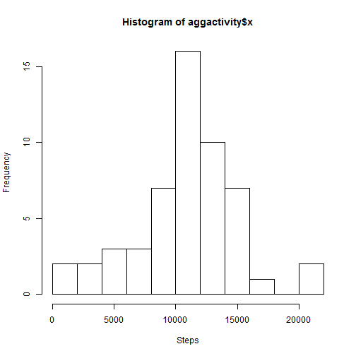
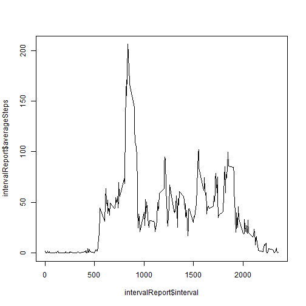
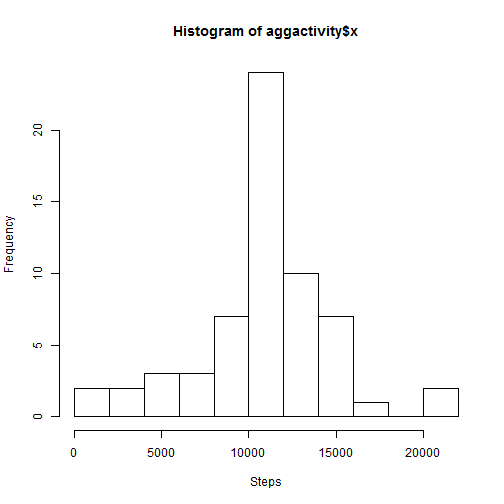
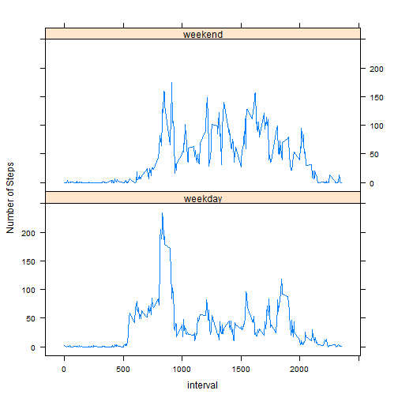

#title: "Reproducible Research: Peer Assessment 1"
output: 
  html_document:
    keep_md: true


## Loading and preprocessing the data

```r
library(dplyr)
rawactivity <- read.csv("activity.csv", header = TRUE)
rawactivity$date <- as.Date(as.character(rawactivity$date), "%Y-%m-%d")
```


## What is mean total number of steps taken per day?

```r
activity <- rawactivity[!is.na(rawactivity$steps),]
aggactivity <- aggregate(activity$steps, list(activity$date), sum)
meanStep <- mean(aggactivity$x)
medianStep <- median(aggactivity$x)
meanStep
```

```
## [1] 10766.19
```

```r
medianStep
```

```
## [1] 10765
```

```r
hist(aggactivity$x, breaks=10, xlab = 'Steps')
```

 
The average totoal number of steps is 1.0766189 &times; 10<sup>4</sup>, and the median total number of steps is 10765.

## What is the average daily activity pattern?

```r
intervalGroups <- group_by(activity, interval)
intervalReport <- summarize(intervalGroups, averageSteps=mean(steps))
plot(intervalReport$interval, intervalReport$averageSteps, type = "l" )
```

 

```r
maxInterval <- intervalReport[(intervalReport$averageSteps == max(intervalReport$averageSteps)), c("interval")]
```
The interval of 835 minutes, on average across all the days in the dataset, contains the maximum number of steps

## Imputing missing values

```r
naIndexes <- which( is.na(rawactivity$steps))
totalMissingValues <- length(naIndexes)
fullactivity <- rawactivity

for(index in naIndexes){
  inter <- fullactivity[index,]$interval
  avgIndex <- which(intervalReport$interval == inter)
  fullactivity[index,]$steps <- intervalReport[avgIndex, ]$averageSteps
}

aggactivity <- aggregate(fullactivity$steps, list(fullactivity$date), sum)
filledmeanStep <- mean(aggactivity$x)
filledmedianStep <- median(aggactivity$x)
filledmeanStep
```

```
## [1] 10766.19
```

```r
filledmedianStep
```

```
## [1] 10766.19
```

```r
hist(aggactivity$x, breaks=10, xlab = 'Steps')
```

 
The total number of missing values in the dataset is 2304.  In order to fill the missing data, use the average steps on the same time in other days.  For example, if the step is NA at interval 25 on 2012-10-02, use the average step value of inteval 25 from other days.

The average step filled data of averages is 1.0766189 &times; 10<sup>4</sup>, and the median step with filled data of average is 1.0766189 &times; 10<sup>4</sup>.  The values are the same as the filled values are just average from the real data on the same time of the day.

## Are there differences in activity patterns between weekdays and weekends?

```r
activity$weekday <- "weekday"
weekendIndex <-  which(format(activity$date, "%a") %in% c("Sat", "Sun"))
activity[weekendIndex,]$weekday <- "weekend"
activity$weekday <- factor(activity$weekday)
weekGroups <- group_by(activity, interval, weekday)
weekReport <- summarize(weekGroups, averageSteps=mean(steps))

library(lattice)
xyplot(averageSteps ~ interval | weekday , data =weekReport, type = "l" , layout=c(1,2), ylab="Number of Steps")
```

 
Based on the Plot, the pattern between weekend and weekend are similar.

